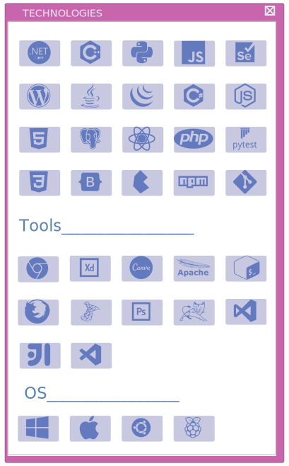

&nbsp;&nbsp;&nbsp;
 
*   Computer Programming and Anaysis Advanced Diploma at Durham College of Applied Arts and Technology (2023).
*   Alumni of OCAD University(2010).    
*   <a href="https://discord.gg/cutekeyboardclub" target="_blank">Member of Cute Keyboard Club Discord Group</a>

  <!--  -->
---

